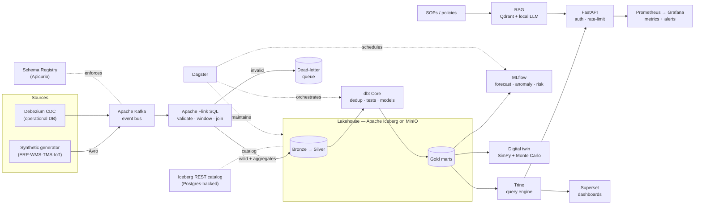

<div align="center">

# 🛰️ Real-Time Supply-Chain Data Platform

**A fully open-source, event-driven lakehouse that gives end-to-end, up-to-the-second visibility across inventory, orders, shipments, suppliers, and IoT sensors — with streaming, ML, RAG, a digital twin, and production-grade hardening. No managed or paid services.**

<br>


<br>


</div>

---

## ⚡ TL;DR

```bash
make up           # start the core stack
make lake-init    # create bronze/silver/gold lakehouse layers
make flink-jobs   # launch the 4 real-time streaming jobs
sleep 90          # let the first 1-minute windows close
make dbt-run      # build the business-ready Gold tables
make smoke        # verify end-to-end  →  "SMOKE OK"
```

Then open the **API** at [localhost:8000/docs](http://localhost:8000/docs) and **Flink** at [localhost:8081](http://localhost:8081).
Full walkthrough → **[docs/RUN_GUIDE.md](docs/RUN_GUIDE.md)** · Non-technical overview → **[docs/Platform_Guide_for_Everyone.docx](docs/Platform_Guide_for_Everyone.docx)**

---

## 📖 Table of Contents

[Why](#-why) · [Architecture](#-architecture) · [What you get](#-what-you-get) · [Capability matrix](#-capability-matrix) · [Production hardening](#-production-hardening) · [Tech stack](#-tech-stack) · [Quickstart](#-quickstart) · [Live data](#-live-data) · [Repo layout](#-repository-layout) · [Operations](#-day-2-operations) · [Design principles](#-design-principles) · [Docs](#-documentation)

---

## 🎯 Why

Manufacturers, retailers, and logistics providers run on **batch** data platforms: signals from ERP, WMS, TMS, and IoT arrive hours late and scattered across silos. By the time a late container, a stockout, or a cold-chain excursion is noticed, the damage is done.

This platform replaces that with a **single, live, trustworthy picture** — ingested the instant events happen, processed in real time, stored in an open lakehouse, and enriched with forecasting, anomaly detection, supplier-risk scoring, a what-if simulator, and a plain-English assistant.

---

## 🏗️ Architecture



**Medallion layers:** `Bronze` (validated raw) → `Silver` (deduped streaming aggregates) → `Gold` (business marts: hourly revenue, carrier performance, inventory health, IoT rollups, masked order facts).

---

## 📦 What You Get

| | Capability |
|---|---|
| 📡 | **Real-time ingestion** — Avro events on Kafka with **enforced schemas** (Apicurio registry) + **Debezium CDC** from an operational database |
| 🌊 | **Stream processing** — Flink SQL with event-time windows, exactly-once checkpointing to Iceberg, and a SQL-native **dead-letter queue** |
| 🧊 | **Open lakehouse** — Apache Iceberg on MinIO (S3), **Postgres-backed REST catalog** for true multi-writer concurrency |
| 🔧 | **Transformations** — dbt Core with **dedup** (no double-counting), data-quality tests, `dbt-expectations`, and **source freshness** |
| 🗓️ | **Orchestration** — Dagster with **per-model dbt asset lineage**, data-quality checks, and scheduled lakehouse maintenance |
| 🤖 | **ML** — demand forecasting, IoT anomaly detection, supplier-risk scoring → tracked in MLflow (artifacts in MinIO) |
| 💬 | **RAG assistant** — embed docs → Qdrant → **local LLM (Ollama)**, fully offline; answers grounded in company documents |
| 🪞 | **Digital twin** — SimPy + Monte Carlo "what-if" simulator (supplier outages, demand spikes, warehouse capacity) |
| 🚪 | **Serving** — FastAPI (API-key auth + rate limiting) and Apache Superset dashboards |
| 📈 | **Observability** — Prometheus + Grafana, with alert rules (target down, error rate, latency, DLQ) |
| 🔐 | **Governance** — PII masking applied in dbt, data contracts enforced in CI, RBAC + secrets policies |
| 🛡️ | **Resilience** — chaos-tested recovery, restart policies, backups (pg_dump + MinIO versioning) |

---

## ✅ Capability Matrix

Everything below is **built, running, and verified end-to-end** (not a plan):

| Area | Status | Evidence |
|---|:---:|---|
| Ingestion (Avro + schema registry, CDC) | ✅ | 5 schemas registered; live UPDATE/INSERT captured |
| Streaming (4 domains, windows, DLQ) | ✅ | 4 jobs RUNNING; malformed records routed to DLQ |
| Lakehouse (Bronze/Silver/Gold) | ✅ | data flows on Avro; queryable via Trino |
| dbt models + dedup + DQ | ✅ | `dbt build` **PASS=33**, source freshness 5/5 |
| Orchestration (dagster-dbt lineage) | ✅ | 16 per-model assets; RUN_SUCCESS |
| ML (3 models → MLflow) | ✅ | runs logged, `model.pkl` artifacts in MinIO |
| RAG (Qdrant + Ollama) | ✅ | grounded answer returned from local LLM |
| Digital twin | ✅ | Monte Carlo service-level / stockout distributions |
| Serving (API auth + rate limit) | ✅ | 401 / 200 / 429 verified |
| Observability (alerts) | ✅ | 4 Prometheus alert rules loaded |
| Chaos / resilience | ✅ | killed broker/taskmanager/MinIO → auto-recovered |

Spec-by-spec detail → **[docs/roadmap.md](docs/roadmap.md)**.

---

## 🛡️ Production Hardening

This isn't a demo that falls over — it has been deliberately stress-tested and hardened across three tiers:

- **Tier 1 — Correctness:** Avro **wire-level schema enforcement** + registry; **Silver dedup** (at-least-once streaming can't double-count); dbt DQ + freshness; data contracts enforced in CI.
- **Tier 2 — Lakehouse hygiene:** scheduled **compaction** (62→1 files), **snapshot expiration** (368→11), orphan cleanup; **day-partitioning**; **backups** (pg_dump + MinIO versioning).
- **Tier 3 — Ops & security:** **API-key auth + rate limiting**; **PII masking** (sha256) applied in dbt; **Prometheus alert rules**; **dagster-dbt** per-model lineage.
- **Chaos-tested:** `make chaos` kills the broker, a task manager, and object storage in turn — the durable layers and streaming jobs recover automatically (findings → [tests/chaos/FINDINGS.md](tests/chaos/FINDINGS.md)).

---

## 🧰 Tech Stack

| Layer | Tools |
|---|---|
| **Event bus / registry** | Apache Kafka (KRaft) · Apicurio Schema Registry |
| **CDC** | Debezium (Kafka Connect) |
| **Stream processing** | Apache Flink (SQL) |
| **Lakehouse** | Apache Iceberg · MinIO · Iceberg REST catalog (Postgres) |
| **Transform** | dbt Core (Trino adapter) · dbt-utils · dbt-expectations |
| **Query** | Trino |
| **Orchestration** | Dagster · dagster-dbt |
| **ML / AI** | MLflow · scikit-learn · statsmodels · Qdrant · Ollama · fastembed |
| **Simulation** | SimPy + Monte Carlo |
| **Serving / BI** | FastAPI · Apache Superset |
| **Observability** | Prometheus · Grafana |
| **Infra** | Docker Compose · GitHub Actions |

> 100% open-source (Apache-2.0 / AGPL where noted). No vendor lock-in, no per-seat licences.

---

## 🚀 Quickstart

**Prerequisite:** Docker Desktop running. Everything else runs in containers.

```bash
cd "Real‑Time Supply‑Chain Data Platform"
make up           # core stack (first run builds images: a few minutes)
make lake-init    # bronze / silver / gold namespaces
make flink-jobs   # 4 streaming jobs  → http://localhost:8081
sleep 90          # let 1-minute windows close
make dbt-run      # build Gold marts (runs in a throwaway container)
make smoke        # end-to-end check → "SMOKE OK"
```

Add optional layers à la carte:

```bash
make bi                                       # Superset dashboards
make obs                                      # Prometheus + Grafana
docker compose --profile ml up -d             # MLflow
docker compose --profile orchestration up -d  # Dagster
docker compose --profile rag up -d            # Qdrant + Ollama + RAG API
make cdc                                       # Debezium change-data-capture
make up-full                                   # everything
```

> Tip: `make demo` chains up → lake-init → flink-jobs. `make help` lists every command.
> Default ports shown below are configurable in `.env`.

---

## 📊 Live Data

The API serves real figures from the Gold marts (data endpoints require an API key):

```bash
$ curl -s localhost:8000/carriers -H "X-API-Key: dev-secret-key" | jq
{
  "count": 5,
  "data": [
    { "carrier": "UPS", "total_shipments": 772, "delayed_shipments": 411,
      "delay_rate": 0.532, "on_time_rate": 0.468 }, …
  ]
}

$ curl -s "localhost:8000/revenue/hourly?limit=1" -H "X-API-Key: dev-secret-key"
# { "region": "LATAM", "revenue_hour": "…T21:00:00", "orders": 2129, "gross_revenue": 13568003.91 }
```

| Service | URL | Login |
|---|---|---|
| API (Swagger) | http://localhost:8000/docs | key `dev-secret-key` |
| Flink | http://localhost:8081 | — |
| Trino | http://localhost:8080 | — |
| MinIO console | http://localhost:9001 | admin / password |
| Superset | http://localhost:8088 | admin / admin |
| Dagster | http://localhost:3000 | — |
| MLflow | http://localhost:5000 | — |
| Grafana | http://localhost:3001 | anon / admin |

---

## 🗂️ Repository Layout

```
docker-compose.yml        # all services (core + profiled layers)
Makefile                  # up · demo · dbt-run · smoke · maintain · backup · chaos …
ingestion/                # Avro generator + JSON data contracts + Debezium CDC config
infra/flink/sql/          # Flink SQL streaming jobs (windows + DLQ)
infra/iceberg-rest/       # Postgres-backed Iceberg REST catalog image
transformations/dbt/      # dbt: Silver staging (deduped) + Gold marts + tests + masking
orchestration/dagster/    # dagster-dbt assets, DQ checks, Iceberg maintenance, schedules
ml/                       # MLflow server + forecasting / anomaly / supplier-risk
rag/                      # fastembed → Qdrant → Ollama Q&A API
digital_twin/             # SimPy + Monte Carlo what-if simulator
serving/api/              # FastAPI over Trino (auth, rate limiting, /metrics)
infra/                    # trino, superset, prometheus (+ alerts), grafana configs
governance/               # RBAC, masking, data-contract policies
tests/                    # integration smoke test · contract tests · chaos experiments
scripts/                  # lake_init · submit_flink_jobs · maintenance · partitioning · backup
docs/                     # RUN_GUIDE · architecture · roadmap · runbook · non-tech guide
.github/workflows/        # CI: compose + python + contracts + dbt parse
```

---

## 🔧 Day-2 Operations

```bash
make maintain    # compact files + expire snapshots + remove orphans
make partition   # day-partition the lakehouse tables (then re-run flink-jobs)
make backup      # pg_dump all databases → ./backups
make contracts   # validate events against the data contracts
make dq          # dbt tests + source freshness
make chaos       # resilience drill (kills broker/taskmanager/MinIO)
make down        # stop, keep data   ·   make clean = stop + wipe data
```

---

## 🧭 Design Principles

- **Open formats over engines** — Iceberg on MinIO is the source of truth; Flink, Trino, dbt, and Spark all read/write the same warehouse.
- **Correctness first** — schemas enforced at the wire, dedup in Silver, quality tests on every build.
- **Fail loud, recover quietly** — malformed records go to a DLQ; services carry restart policies and recover from checkpoints (proven by chaos tests).
- **Graceful degradation** — the API returns a `note` instead of a 500 when a table isn't ready, so it's usable the moment the stack is up.
- **Lean core, opt-in depth** — the core slice is small; BI/ML/RAG/observability/CDC are profiles you enable on demand.

---

## 📚 Documentation

| Doc | For |
|---|---|
| **[docs/RUN_GUIDE.md](docs/RUN_GUIDE.md)** | Step-by-step terminal run guide |
| **[docs/architecture.md](docs/architecture.md)** | Architecture + data flow |
| **[docs/roadmap.md](docs/roadmap.md)** | Spec-by-spec status + what's next |
| **[docs/runbook.md](docs/runbook.md)** | URLs, operations, troubleshooting |
| **[tests/chaos/FINDINGS.md](tests/chaos/FINDINGS.md)** | Chaos-test results |
| **[docs/Platform_Guide_for_Everyone.docx](docs/Platform_Guide_for_Everyone.docx)** | Plain-English overview for non-technical readers |

---

<div align="center">

**Built with 100% open-source tools — streaming, lakehouse, ML, RAG, digital twin, and production hardening, all running locally.**

</div>
