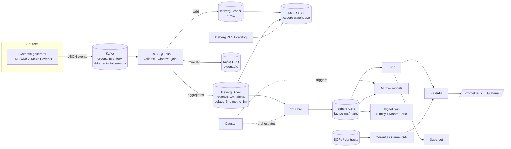

# Architecture

## Data flow (vertical slice — implemented)

## Why these components
- **Kafka (KRaft)** — durable, replayable event bus; auto-creates topics in dev.
- **Flink SQL** — declarative stream processing with event-time windows,
  exactly-once checkpointing to Iceberg, and a SQL-native DLQ split.
- **Iceberg on MinIO + REST catalog** — open table format (ACID, schema
  evolution, time travel) on S3-compatible storage; one warehouse, many engines.
- **Trino** — federated SQL engine that both dbt and the API/Superset share.
- **dbt Core** — versioned, tested Bronze→Silver→Gold transformations.
- **Dagster** — code-defined orchestration of the batch/ML/quality assets.
- **FastAPI / Superset** — programmatic + visual consumption.
- **Prometheus/Grafana** — metrics; the API exposes `/metrics`.

## Medallion layers
| Layer | Owner | Contents |
|---|---|---|
| Bronze | Flink | validated raw events (`bronze.*_raw`) |
| Silver | Flink | streaming aggregates/alerts (`silver.*`) |
| Gold | dbt | business marts: `fct_revenue_hourly`, `agg_inventory_health`, `fct_carrier_performance`, `fct_iot_hourly` |

## Roadmap layers (scaffolded, see per-folder READMEs)
- **ML/AI** (`ml/`) — forecasting, anomaly detection, supplier risk → MLflow.
- **RAG** (`rag/`) — embeddings in Qdrant, answers via local Ollama LLM.
- **Digital twin** (`digital_twin/`) — SimPy + Monte Carlo what-if simulation.
- **Metadata/Knowledge graph** — DataHub (run as its own compose stack and point
  its ingestion recipes at Kafka/Trino/dbt; lineage from dbt `manifest.json`).
- **Governance** (`governance/`) — RBAC, masking, audit, data contracts.
- **Ingestion connectors** — Airbyte OSS (API sources) + Debezium (CDC) feeding
  the same Kafka topics the generator uses today.
